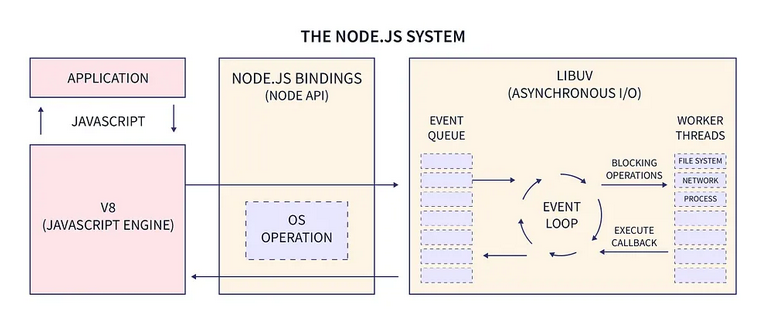

## Secret of scalability of nodejs

Unlike Apache, it uses small number of threads to handle clients.

## Thread

They are responsive to handle the complex expensive tasks which can be referred as asynchronous tasks.(like file I/O)

# Blocked Thread

If a thread either main thread or worker threads(on thread pool) takes long time to execute a callback, then it is called blocked.

- The thread blocking refers to thread being unavailable at the time of serving other users.
- The callbacks of requests from user could be synchronous or asynchronous is handled by event loop and worker thread.

- The Event Loop also fulfill the asynchronous request which are non blocking, and js callbacks which are registered for event loops.

## Event Loop

 The main thread in nodejs architecture handles the blocking operations (synchronous tasks/ js callbacks registered for event loops), event loop management and assignes works to the threads.
- Here the main thread is not blocked, as it doesnot performs blocking operations like multi threaded language.

## Worker Threads

- The worker threads which are availble in the thread pool are provided by linuv to the event loop.
- By default only 4 threads are present in the thread pool.
- Additional Thread in the system is used for parallel execution of the resource consuming expensive processes.

so mostly, the worker thread executes the nodejs module Apis.

Also, APIs which uses C++ add-on uses worker/thread pool.

## How actually APIs tasks are handed to the Thread/Worker pool?

- Firstly, we have a request which uses nodejs module APIs, assume it also uses c++ bindings.

- C++ bindings are present internally in the nodejs configuration.

- That request is in the queue. After that, when it turns come, the Event Loop pays some minor cost which is ,for setup of that task. This means, the bindings are linked and configured it to work with the internal C++ bindings that nodejs have.

- The time is also spent by the main thread in the event loop which can be neglected, and after that, it passes that task to the worker thread.

- Before passing to the worker thread, the nodejs provides a pointer to the c++ function in nodejs internal C++ bindings.So, it means the pointer points the input to that c++ function , and execution is happened in worker thread(this is where the worker thread get the job) and output is returned through callback or promise.

# Management of Pending Events and Tasks.

Event loop has queues for pending events.
Worker pool has queues for pending tasks.

# NOTE:
Event Loop doesnot maintain the queue.
rather, os informs the event loop about the requests made to the network socket.

>follow eventloop_queue_os.js

Worker pool actually uses real queue whose entries entries are tasks. It pops a task from queue and work on it.
when that tasks is finished, worker raises an event telling event loop that, one task has been finished.

# Tips to make the nodejs application faster.

Nodejs have smaller threads for handling multiple clients. so, if any thread is blocked, then other clients will be affected. In order to make the thread work faster without getting blocked, we shouldn't do too much work in single callback/promise.

So, the performance of the appplication depends on , how  much expensive a single callback is, in application.

Also, Event Loop should not be blocked. Meaning: the things which the nodejs has assigned the event loop to do certain things like handling js callbacks and some asynchronous tasks related to network IO and so. 
If the callbacks are expensive(if it takes more time to execute), then the new clients will be affected.

To Ensure event loop not getting blocked, js callbacks/promises.then or await should be quickly completed.

